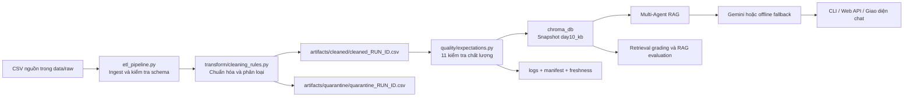
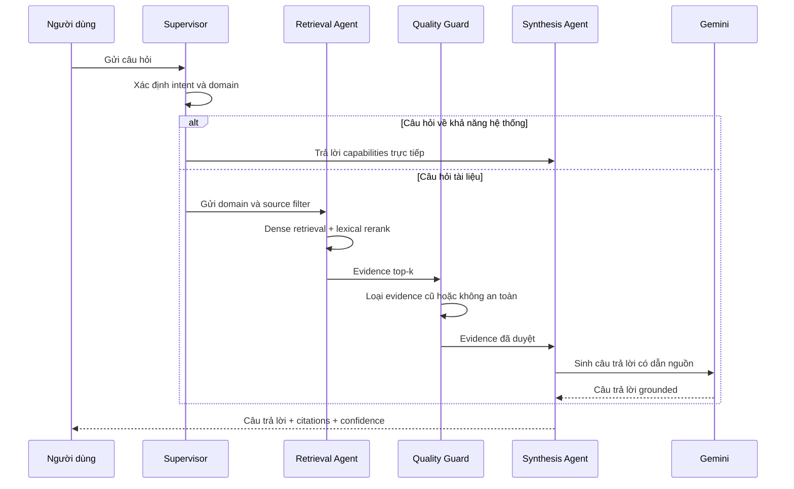

# Hướng dẫn luồng xử lý dữ liệu và Multi-Agent RAG

Tài liệu này mô tả toàn bộ hệ thống đã hoàn thiện trong thư mục `lab`: dữ liệu đi qua từng bước như thế nào, mỗi file chịu trách nhiệm gì, các thay đổi đã thực hiện và kết quả sau cải tiến.

## 1. Tổng quan hệ thống



Kết quả hiện tại của pipeline:

| Chỉ số | Kết quả |
|---|---:|
| Dòng dữ liệu đầu vào | 247 |
| Dòng sạch được xuất bản | 35 |
| Dòng bị quarantine | 212 |
| Tài liệu chuẩn được bao phủ | 5 |
| Quality expectations | 11/11 đạt |
| Official ETL grading | 10/10 |
| Multi-Agent RAG evaluation | 10/10 |
| Extended retrieval evaluation | 20/21 |
| Unit tests RAG agents | 4/4 đạt |

## 2. Luồng xử lý dữ liệu chi tiết

### Bước 1: Đọc dữ liệu đầu vào

`etl_pipeline.py` đọc các file CSV từ thư mục dữ liệu nguồn. Mỗi dòng được coi là một đoạn tri thức có các trường như:

- `doc_id`: mã tài liệu nguồn.
- `text`: nội dung dùng để tìm kiếm và trả lời.
- `effective_date`: ngày nội dung bắt đầu có hiệu lực.
- `exported_at`: thời điểm dữ liệu được xuất.

Ngay sau khi đọc, pipeline kiểm tra schema để phát hiện sớm dữ liệu thiếu cột hoặc sai cấu trúc.

### Bước 2: Chuẩn hóa và phân loại dữ liệu

`transform/cleaning_rules.py` chuẩn hóa dữ liệu theo thứ tự:

1. Chuẩn hóa `doc_id`, nội dung, ngày hiệu lực và thời gian xuất.
2. Chỉ chấp nhận 5 nguồn tài liệu chuẩn:
   - `policy_refund_v4`
   - `sla_p1_2026`
   - `it_helpdesk_faq`
   - `hr_leave_policy`
   - `access_control_sop`
3. Đưa dòng thiếu nội dung hoặc thiếu ngày hiệu lực vào quarantine.
4. Loại tài liệu không nằm trong allowlist.
5. Loại nội dung mơ hồ, dữ liệu migration và bản ghi trùng.
6. Loại chính sách nghỉ phép HR cũ theo ngày và theo nội dung ngữ nghĩa.
7. Chuẩn hóa chính sách hoàn tiền cũ từ 14 ngày về 7 ngày.
8. Tạo `chunk_id` ổn định để chạy lại pipeline không sinh bản ghi trùng.
9. Thêm ngữ cảnh nguồn vào nội dung retrieval để tăng khả năng tìm kiếm đúng.

Dữ liệu được chia thành hai nhánh:

- `artifacts/cleaned/cleaned_<run_id>.csv`: chỉ chứa dữ liệu đạt yêu cầu để đưa vào hệ thống hỏi đáp.
- `artifacts/quarantine/quarantine_<run_id>.csv`: chứa dữ liệu bị loại cùng lý do cụ thể để kiểm tra.

Phân bố nguyên nhân quarantine hiện tại:

| Lý do | Số dòng |
|---|---:|
| Tài liệu không thuộc danh sách chuẩn | 109 |
| Bản ghi trùng | 52 |
| Chính sách HR cũ theo ngày | 22 |
| Chính sách HR cũ theo nội dung | 8 |
| Thiếu nội dung | 8 |
| Nội dung mơ hồ hoặc migration | 7 |
| Thiếu ngày hiệu lực | 6 |

### Bước 3: Kiểm tra chất lượng trước khi xuất bản

`quality/expectations.py` chạy 11 expectations trên dữ liệu sạch:

- Có đủ số lượng dòng tối thiểu.
- Không có nội dung rỗng.
- Không còn chính sách hoàn tiền cũ.
- Độ dài nội dung hợp lệ.
- Ngày hiệu lực đúng ISO.
- Không còn chính sách HR cũ.
- `chunk_id` không rỗng và không trùng.
- Chỉ chứa tài liệu chuẩn.
- Bao phủ đủ các nguồn bắt buộc.
- Ngày HR đáp ứng ngưỡng cấu hình.
- `exported_at` đúng định dạng.

Nếu kiểm tra mức nghiêm trọng thất bại, ETL dừng trước khi xuất bản vector store. Kiểm tra cảnh báo vẫn được ghi log để theo dõi.

### Bước 4: Xuất bản snapshot vào Chroma

Sau khi dữ liệu sạch vượt quality gate, `etl_pipeline.py` tạo embedding và cập nhật collection Chroma `day10_kb`.

Pipeline dùng `chunk_id` ổn định, thực hiện upsert bản ghi mới và xóa bản ghi cũ không còn trong snapshot. Nhờ đó, chạy ETL nhiều lần vẫn cho cùng một trạng thái dữ liệu thay vì tích lũy bản ghi trùng.

### Bước 5: Ghi log, manifest và kiểm tra freshness

Mỗi lần chạy tạo log và manifest, bao gồm:

- `run_id`.
- Số dòng raw, clean và quarantine.
- Số lượng theo từng nguyên nhân quarantine.
- Số lượng theo từng nguồn tài liệu.
- Thời gian thực thi của từng stage.
- Trạng thái expectations và snapshot Chroma.

`monitoring/freshness_check.py` đọc manifest để xác định dữ liệu đang `PASS`, `WARN` hay `FAIL` so với freshness SLA.

Mẫu dữ liệu hiện tại có thể báo `FAIL` freshness vì watermark là ngày `2026-04-11`, cũ hơn SLA 24 giờ. Đây là cảnh báo đúng với dữ liệu mẫu, không phải lỗi ETL.

## 3. Luồng hỏi đáp Multi-Agent RAG



Vai trò của từng agent:

- `rag_agents/supervisor.py`: phân loại câu hỏi, xác định domain và quyết định tuyến xử lý.
- `rag_agents/retrieval.py`: tìm kiếm Chroma, lọc theo nguồn và xếp hạng lại bằng dense score kết hợp lexical score.
- `rag_agents/quality_guard.py`: loại evidence cũ, không đúng chính sách hoặc không đủ tin cậy.
- `rag_agents/synthesis.py`: tạo câu trả lời có dẫn nguồn bằng Gemini; tự chuyển sang offline extractive fallback nếu Gemini không khả dụng.
- `multi_agent_rag.py`: điều phối toàn bộ state giữa các agent và lưu trace để debug.

Câu hỏi “Bạn có thể giải đáp những gì?” được nhận diện là intent `capabilities`, vì vậy hệ thống trả lời danh sách chủ đề hỗ trợ thay vì lấy ngẫu nhiên một đoạn SLA P1 từ vector store.

## 4. Vai trò và cải tiến của từng file

### Dữ liệu, cấu hình và hợp đồng

| File | Xử lý gì | Thay đổi và cải tiến |
|---|---|---|
| `data/test_questions.json` | Bộ 21 câu hỏi kiểm thử retrieval mở rộng | Dùng để đo câu đúng, nội dung cấm và top-1 source; phát hiện các trường hợp retrieval khó |
| `data/grading_questions.json` | Bộ 10 câu hỏi chấm chính thức | Dùng làm tiêu chuẩn kiểm tra đầu ra ETL và RAG |
| `contracts/data_contract.yaml` | Khai báo schema, owner, freshness và nguồn chuẩn | Bổ sung allowlist, nguồn bắt buộc và ngưỡng ngày HR |
| `contracts/rag_agent_contracts.yaml` | Khai báo input/output giữa các agent | Giúp luồng multi-agent rõ ràng, dễ kiểm tra và mở rộng |
| `.env.example` | Mẫu cấu hình môi trường | Bổ sung cấu hình Gemini, Chroma, collection và ngưỡng xử lý; không chứa API key thật |
| `requirements.txt` | Danh sách thư viện | Bổ sung thư viện cần thiết cho ETL, Chroma, embedding và Gemini |

### ETL và chất lượng dữ liệu

| File | Xử lý gì | Thay đổi và cải tiến |
|---|---|---|
| `etl_pipeline.py` | Điều phối toàn bộ ETL | Thêm schema check, clean/quarantine, quality gate, Chroma snapshot, manifest, timing và observability |
| `transform/cleaning_rules.py` | Chuẩn hóa và loại dữ liệu không hợp lệ | Thêm allowlist, HR cutoff, phát hiện nội dung HR cũ, sửa refund 14 thành 7 ngày, chống trùng bằng stable ID |
| `quality/expectations.py` | Kiểm tra dữ liệu sạch trước publish | Mở rộng thành 11 expectations với mức cảnh báo và dừng pipeline |
| `monitoring/freshness_check.py` | Kiểm tra độ mới dữ liệu | Đọc manifest và trả trạng thái `PASS/WARN/FAIL` theo SLA |
| `inject_bad_record.py` | Chèn dữ liệu lỗi có chủ đích | Chỉ dùng để demo việc pipeline phát hiện và loại nội dung cấm |

### Đánh giá và kiểm thử

| File | Xử lý gì | Thay đổi và cải tiến |
|---|---|---|
| `eval_retrieval.py` | Đánh giá retrieval với bộ câu hỏi mở rộng | Kiểm tra expected answer, forbidden answer và top-1 source |
| `grading_run.py` | Chấm snapshot Chroma theo bộ chính thức | Xác nhận dữ liệu đã publish trả về đúng nội dung |
| `instructor_quick_check.py` | Kiểm tra nhanh cho người chấm | Tổng hợp sanity checks và manifest |
| `eval_multi_agent_rag.py` | Chấm luồng multi-agent end-to-end | Xác nhận agent routing, guard và synthesis cùng hoạt động đúng |
| `tests/test_rag_agents.py` | Unit test các agent | Kiểm tra routing, capabilities intent, guard và fallback |

### Multi-Agent RAG

| File | Xử lý gì | Thay đổi và cải tiến |
|---|---|---|
| `multi_agent_rag.py` | Orchestrator và CLI hỏi đáp | Lưu trace, citations, confidence và trạng thái cần human review |
| `rag_agents/supervisor.py` | Phân loại intent/domain | Thêm route theo nghiệp vụ và xử lý riêng câu hỏi capabilities |
| `rag_agents/retrieval.py` | Truy xuất evidence từ Chroma | Thêm source filter, cache model/collection và lexical rerank |
| `rag_agents/quality_guard.py` | Kiểm duyệt evidence | Chặn chính sách cũ và evidence không phù hợp trước synthesis |
| `rag_agents/synthesis.py` | Sinh câu trả lời cuối | Tích hợp Gemini, bắt buộc grounded citations và có offline fallback |

### Giao diện và API

| File | Xử lý gì | Thay đổi và cải tiến |
|---|---|---|
| `rag_web.py` | Web server và REST API | Thêm `/api/health`, `/api/ask`, lọc thông tin nhạy cảm khỏi response |
| `web/index.html` | Khung giao diện chat | Hiển thị chat, nguồn, confidence, provider và trace |
| `web/styles.css` | Thiết kế giao diện | Giao diện responsive, rõ trạng thái và dễ đọc |
| `web/app.js` | Tương tác frontend với API | Gửi câu hỏi, render câu trả lời, citations và chi tiết agent |
| `project_summary.html` | Báo cáo HTML độc lập | Tổng hợp kết quả, cải tiến và pipeline để trình bày |

### Tài liệu vận hành

| File | Nội dung |
|---|---|
| `README.md` | Hướng dẫn chính và cách chạy dự án |
| `docs/pipeline_architecture.md` | Kiến trúc pipeline |
| `docs/data_contract.md` | Giải thích data contract |
| `docs/runbook.md` | Quy trình vận hành và xử lý sự cố |
| `docs/quality_report.md` | Báo cáo chất lượng dữ liệu |
| `docs/sprint_completion_checklist.md` | Checklist hoàn thành 4 Sprint |
| `docs/multi_agent_rag.md` | Thiết kế và cách dùng Multi-Agent RAG |

## 5. Những vấn đề đã được sửa

| Trước cải tiến | Sau cải tiến |
|---|---|
| Dữ liệu sai hoặc cũ có thể lọt vào vector store | Clean/quarantine rõ ràng và có 11 quality gates |
| Nội dung HR cũ chỉ được kiểm tra đơn giản | Kiểm tra cả ngày hiệu lực và nội dung ngữ nghĩa |
| Chạy ETL lại có nguy cơ sinh bản ghi trùng | Stable `chunk_id`, upsert và prune snapshot |
| Khó biết stage nào lỗi hoặc chậm | Log `run_id`, row counts, reason counts và stage durations |
| Retrieval có thể lấy nhầm domain | Supervisor định tuyến và retrieval lọc theo nguồn |
| Evidence cũ có thể được dùng để trả lời | Quality Guard kiểm tra trước synthesis |
| Câu hỏi về khả năng hệ thống trả về một đoạn tài liệu ngẫu nhiên | Intent `capabilities` được xử lý riêng |
| Phụ thuộc hoàn toàn vào Gemini | Có offline extractive fallback |
| API có nguy cơ lộ trace hoặc cấu hình nhạy cảm | Response công khai được lọc trước khi gửi frontend |

## 6. Kết quả kiểm thử và điểm còn hạn chế

- Official ETL grading đạt `10/10`.
- Official Multi-Agent RAG evaluation đạt `10/10`.
- Dữ liệu lỗi demo có forbidden hit giảm từ `1` xuống `0` sau ETL.
- Extended retrieval đạt `20/21`.
- Trường hợp còn thiếu là `q_p1_update_frequency`: câu trả lời “cập nhật mỗi 30 phút” tồn tại trong dữ liệu nhưng embedding baseline chưa xếp chunk này vào top-3. Multi-Agent RAG xử lý tốt hơn nhờ định tuyến domain và rerank.
- Freshness của dữ liệu mẫu đang báo cũ so với SLA 24 giờ; cần nạp dữ liệu mới khi chạy trong môi trường thực tế.

## 7. Các lệnh vận hành chính

Chạy từ thư mục `lab`.

```powershell
pip install -r requirements.txt
Copy-Item .env.example .env
```

Chạy ETL:

```powershell
python etl_pipeline.py run --run-id optimized-final
```

Kiểm tra freshness và retrieval:

```powershell
python etl_pipeline.py freshness --manifest artifacts/manifests/manifest_optimized-final.json
python eval_retrieval.py
python grading_run.py
python instructor_quick_check.py
```

Hỏi đáp bằng Multi-Agent RAG:

```powershell
python multi_agent_rag.py "Ticket P1 được cập nhật bao lâu một lần?"
python eval_multi_agent_rag.py
```

Khởi động giao diện web:

```powershell
python rag_web.py
```

Sau đó truy cập `http://127.0.0.1:8000`.

## 8. Cách kiểm tra khi kết quả chưa đúng

Nếu dữ liệu ETL chưa đúng:

1. Xem manifest mới nhất để kiểm tra số dòng và trạng thái expectations.
2. Xem file mới nhất trong `artifacts/quarantine/` và cột lý do loại.
3. Kiểm tra file mới nhất trong `artifacts/cleaned/`.
4. Chạy `grading_run.py` để xác nhận snapshot Chroma.

Nếu câu trả lời RAG chưa đúng:

1. Kiểm tra intent và domain do Supervisor chọn.
2. Kiểm tra evidence được Retrieval Agent lấy về.
3. Kiểm tra evidence nào bị Quality Guard loại.
4. Kiểm tra citations, confidence và provider của câu trả lời.
5. Dùng trace từ CLI hoặc giao diện web để xác định stage cần cải tiến.

## 9. Bảo mật API key

- API key Gemini chỉ được đặt trong `.env`.
- `.env` đã được cấu hình để không commit vào Git.
- Không ghi API key vào README, log, trace hoặc response của API.
- Nếu key từng được chia sẻ công khai, cần thu hồi và tạo key mới trước khi sử dụng tiếp.

## 10. Kết luận

Hệ thống hiện đã hoàn thiện luồng từ dữ liệu thô đến ứng dụng hỏi đáp: dữ liệu được làm sạch, kiểm tra chất lượng, xuất bản idempotent vào Chroma, đánh giá tự động, truy xuất qua nhiều agent, kiểm duyệt evidence, tổng hợp bằng Gemini hoặc fallback và hiển thị trên giao diện web. Các log, manifest, báo cáo và bộ test giúp xác minh kết quả thay vì chỉ dựa vào câu trả lời quan sát được.
