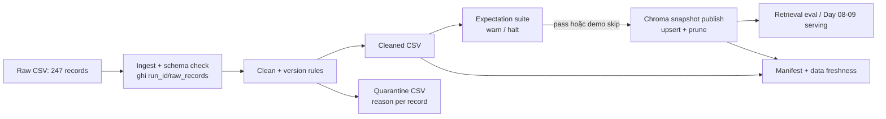

# Kiến trúc pipeline - Lab Day 10

**Nhóm:** Data Pipeline Team
**Cập nhật:** 2026-06-10

## 1. Sơ đồ luồng

`run_id` nối log, cleaned CSV, quarantine CSV và manifest. Freshness được đo trên
`latest_exported_at` sau publish; thời gian chạy từng stage được ghi trong manifest.

## 2. Ranh giới trách nhiệm

| Thành phần | Input | Output | Owner |
|---|---|---|---|
| Ingest | `data/raw/policy_export_dirty.csv` | rows + schema status | Ingestion Owner |
| Transform | raw rows + allowlist + version cutoff | cleaned rows + quarantine reasons | Cleaning Owner |
| Quality | cleaned rows | expectation results + quyết định halt | Quality Owner |
| Embed | cleaned CSV | collection `day10_kb` | Embed Owner |
| Monitor | manifest + watermark export | PASS/WARN/FAIL freshness | Monitoring Owner |

## 3. Idempotency và rerun

`chunk_id` được tạo ổn định từ `doc_id` và source `chunk_id`, không phụ thuộc thứ tự
dòng CSV. Chroma dùng `upsert` theo `chunk_id`; trước publish, pipeline lấy danh sách
ID hiện tại và xóa các ID không còn trong cleaned snapshot. Vì vậy rerun không làm
phình collection và vector stale không tồn tại sau run chuẩn.

## 4. Liên hệ Day 09

Pipeline xuất bản collection Chroma riêng `day10_kb`. Agent Day 09 có thể dùng cùng
`CHROMA_DB_PATH` và `CHROMA_COLLECTION` để retrieval. Tách collection giúp kiểm thử
và rollback pipeline dữ liệu mà không ảnh hưởng trực tiếp collection đang phục vụ.

## 5. Rủi ro đã biết

- Watermark mẫu là `2026-04-11`, nên freshness SLA 24 giờ báo FAIL vào `2026-06-10`.
- Embedding semantic có thể chưa đạt top-1 ở toàn bộ bộ eval mở rộng dù grading pass.
- `--skip-validate` chỉ dành cho Sprint 3; dùng trong production có thể publish dữ liệu xấu.
